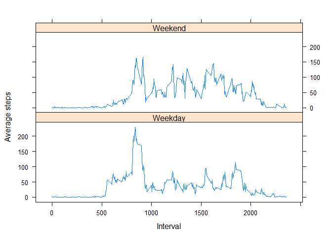

# mparkinson Peer Assessment 1
Matthew Parkinson  
Thursday, July 16, 2015  

###Loading and pre-processing data
I am going to read in the data.  The headings are steps, date, and interval.


```r
activityData <- read.csv("activity.csv")
```

### What is mean total number of steps taken per day?
Calculate the number of steps taken per day.  I prefer ddply as my method to do this.


```r
library(plyr)
```

```
## Warning: package 'plyr' was built under R version 3.1.3
```

```r
stepsPerDay <- ddply(activityData, .(date), summarize,
                     totalSteps = sum(steps, na.rm = TRUE))
totalSteps <- stepsPerDay$totalSteps
```

Display the number of steps taken per day in a histogram.

```r
hist(stepsPerDay$totalSteps,
     main = "Steps per Day",
     xlab = "Total steps per day")
```

 

Caculate and report the mean and median steps per day

```r
meanSteps <- mean(totalSteps)
medianSteps <- median(totalSteps)
```

The mean number of steps is 9354.2295082.

The median number of steps is 10395.

### What is the average daily activity pattern?

Make a time series plot (i.e. type = "l") of the 5-minute interval (x-axis) and the average number of steps taken, averaged across all days (y-axis)

```r
stepsPerInterval <- ddply(activityData, .(interval), summarize,
                     averageSteps = mean(steps, na.rm = TRUE))
plot(stepsPerInterval$interval, stepsPerInterval$averageSteps, type = "l",
     xlab = "Interval", ylab = "Average steps")
```

 


Calculate and report the highest average steps per interval

```r
highestIntervalValue <- max(stepsPerInterval$averageSteps)
correspondingIntervalSubset <- subset(stepsPerInterval, averageSteps == highestIntervalValue)
correspondingInterval <- correspondingIntervalSubset$interval
```
The most steps averaged is 206.1698113.
The corresponding interval is 835.


### Imputing missing values
Calculate and report the total number of missing values

```r
countMissingValues <- sum(is.na(activityData$steps))
```
The number of days missing steps is 2304.

Devise a strategy for filling in all of the missing values.
Create a new data frame with filled in values.

```r
revisedData <- activityData
rowCount <- nrow(revisedData)

for (i in 1:rowCount)
  if (is.na(revisedData$steps[i])) {
    revisedData$steps[i] <- stepsPerInterval[
      which(revisedData$interval[i] == stepsPerInterval$interval), ]$averageSteps
    }
```

Create a histogram of the steps taken per day.  Calculate new mean and median and discuss differences with original data set.

```r
fullStepsPerDay <- ddply(revisedData, .(date), summarize,
                     fullTotalSteps = sum(steps))
fullTotalSteps <- fullStepsPerDay$fullTotalSteps
hist(fullStepsPerDay$fullTotalSteps,
     main = "Steps per Day After filling NAs",
     xlab = "Total steps per day after filling NAs")
```

 

```r
fullMeanSteps <- mean(fullTotalSteps)
fullMedianSteps <- median(fullTotalSteps)
```

The revised mean is 1.0766189\times 10^{4}.  The original mean was 9354.2295082.
The revised median is 1.0766189\times 10^{4}.  The original median was 10395.
Looking at the histograms and comparing the means and median, including the NAs clearly makes an impact on the values

In both cases, the mean and median increased.  Please excuse the scientific notation.

### Are there differences in activity level between weekdays and weekends?

```r
dayType <- function(date) {
  dayOfWeek <- weekdays(date)
  if (dayOfWeek %in% c("Monday", "Tuesday", "Wednesday", "Thursday", "Friday"))
    return("Weekday")
  else return("Weekend")
}
revisedData$date <- as.Date(revisedData$date)
revisedData$dayOfWeek <- sapply(revisedData$date, FUN=dayType)
```


```r
avgByDayType <- ddply(revisedData, .(dayOfWeek, interval), summarize,
                     avgSteps = mean(steps))

library(lattice)
xyplot(avgByDayType$avgSteps ~ avgByDayType$interval | avgByDayType$dayOfWeek,
  type = "l", layout = c(1,2), xlab = "Interval", ylab = "Average steps")
```

 

It appears that activity is more varied throughout the day on weekends.  On weekdays, it seems to be centered around the beginning of the day. 
